# 个人求职 Agent — 当前项目架构

> **状态快照**：2026-08-27  
> **原则**：Chat Core 是产品本体；Boss / 猎聘等是 Channel 适配器。  
> **演进规划**：[`roadmap/README.md`](./roadmap/README.md) · **边界论证**：[`roadmap/ARCHITECTURE.md`](./roadmap/ARCHITECTURE.md)

---

## 1. 一句话

候选人维护**本地 Markdown 知识库**，Next.js 提供 **RAG 对话 Core**；HR 通过 **限时分享链接** 或 **Boss Bridge 渠道** 对话，回答经历 / 项目 / 技术问题，并受敏感话题与防幻觉策略约束。

---

## 2. 系统上下文（C4 · Context）

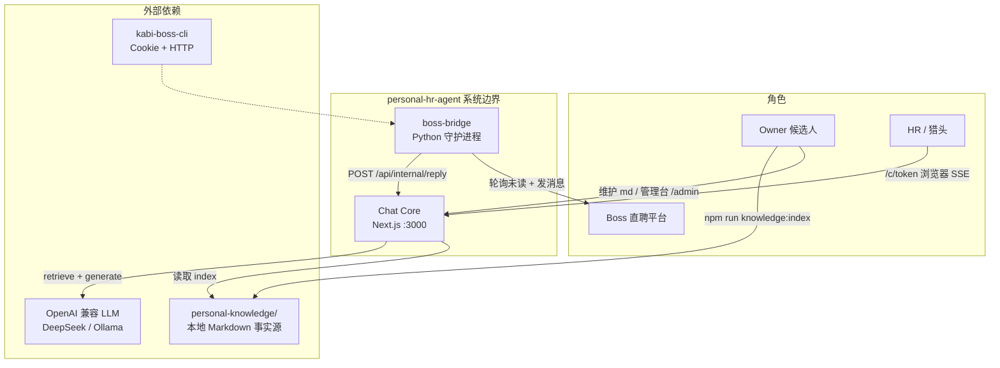

| 角色 | 入口 | 说明 |
|------|------|------|
| Owner | `/admin` | 创建/作废分享链接、配置依赖 `.env.local` |
| Guest (HR) | `/c/<token>` | 凭 token 流式对话，无需注册 |
| Channel (Boss) | `boss-bridge/main.py` | 拉取 Boss 会话 → 调 Core → dry-run 或发送 |
| 知识库 | `KNOWLEDGE_DIR` | **本地专用**，默认 `personal-knowledge/`，不进 git |

---

## 3. 容器视图（Core vs Channel vs 数据）

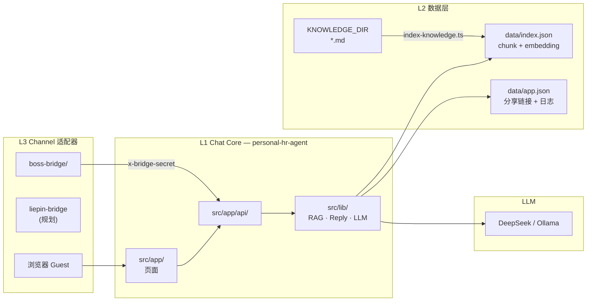

### 职责边界

| 层 | 目录 | 负责 | 不负责 |
|----|------|------|--------|
| **Core** | `src/` | RAG、Prompt、敏感拦截、分享链接、LLM | Boss Cookie、会话列表、平台 ToS |
| **Channel** | `boss-bridge/` | 登录态、拉消息、格式化、发送/dry-run | 复制 RAG/Prompt 逻辑 |
| **Knowledge** | `personal-knowledge/`（机外） | 事实源 Markdown | 运行时状态 |
| **Runtime** | `data/` | 索引、链接、聊天日志 | 知识原文 |

---

## 4. Chat Core 内部模块

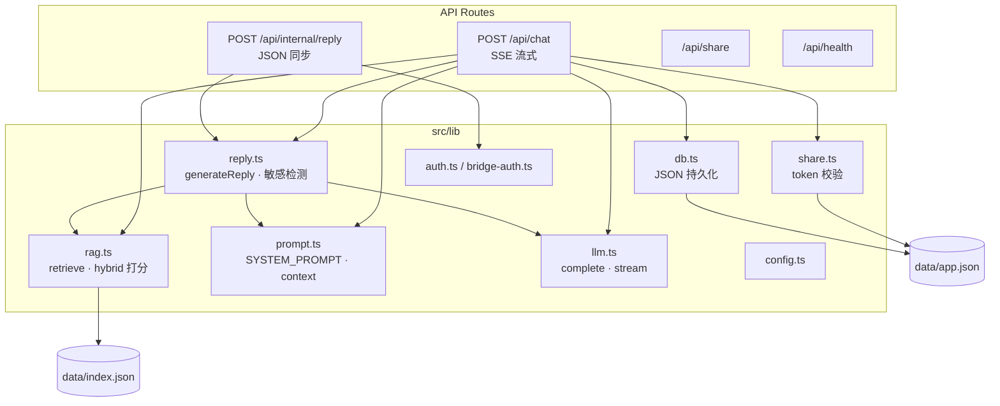

### 核心文件说明

| 模块 | 路径 | 作用 |
|------|------|------|
| 统一回复 | `src/lib/reply.ts` | Guest 与 Channel **共用**：敏感检测 → 检索 → LLM |
| 检索 | `src/lib/rag.ts` | 读 `index.json`；**local_hash**（默认）或 API embedding + 关键词混合 |
| 提示词 | `src/lib/prompt.ts` | System prompt + 检索片段格式化 |
| 分享 | `src/lib/share.ts` | token 创建、过期、消息上限、作废 |
| 渠道鉴权 | `src/lib/bridge-auth.ts` | `x-bridge-secret` 校验 |
| 配置 | `src/lib/config.ts` | `KNOWLEDGE_DIR`、`LLM_*`、`BOSS_BRIDGE_SECRET` |

---

## 5. 数据架构

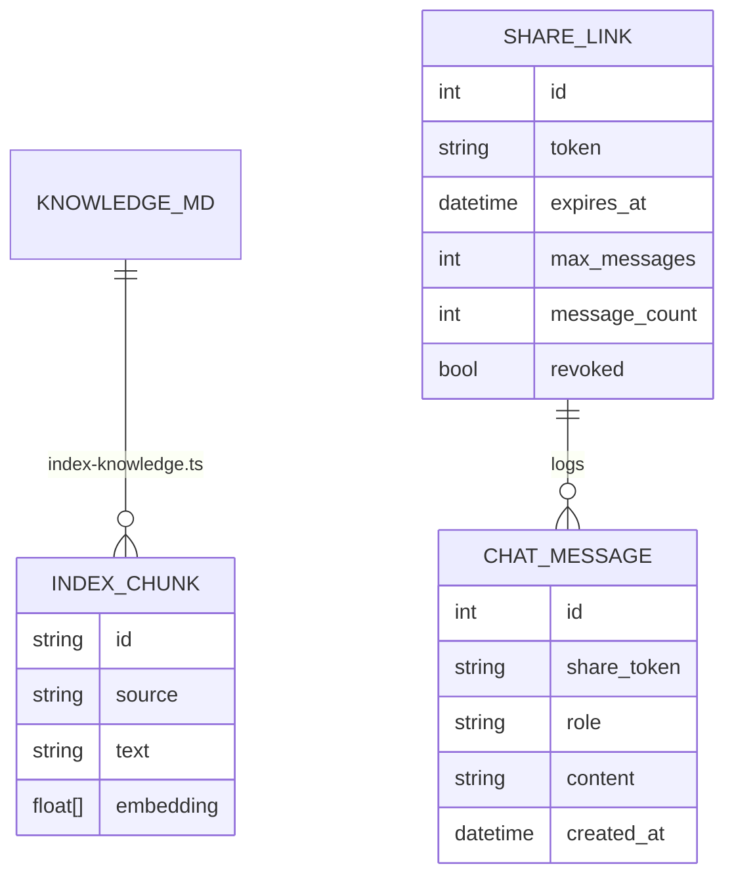

| 存储 | 路径 | 内容 | Git |
|------|------|------|-----|
| 知识原文 | `KNOWLEDGE_DIR`（默认 `../personal-knowledge/`） | 分类 md：基本信息、项目、FAQ、boundaries | **永不提交** |
| 检索索引 | `data/index.json` | chunk 文本 + embedding 向量 | gitignore |
| 应用状态 | `data/app.json` | 分享链接、聊天日志 | gitignore |
| 评测 | `evals/golden.jsonl` | 黄金问答集 | 可提交 |

### 知识库目录（本地 `personal-knowledge/`）

```text
01-基本信息/     身份、求职双轨、离职、薪资、到岗
02-工作经历/     公司分段 + timeline
03-项目经历-在职/  eBay / 爱立信真实项目
04-项目经历-架构理解/  RAG/Agent 个人理解
05-技能与问答/   skills、FAQ、boundaries
06-07 原始资料/  gds、obsidian 副本
08-简历参考/     双轨简历真源
_meta/           口径统一、审查清单
```

索引命令：`npm run knowledge:index` → 扫描 `KNOWLEDGE_DIR` 下全部 `.md` 写入 `data/index.json`。

---

## 6. 对话链路

### 6.1 Guest 分享页（SSE 流式）

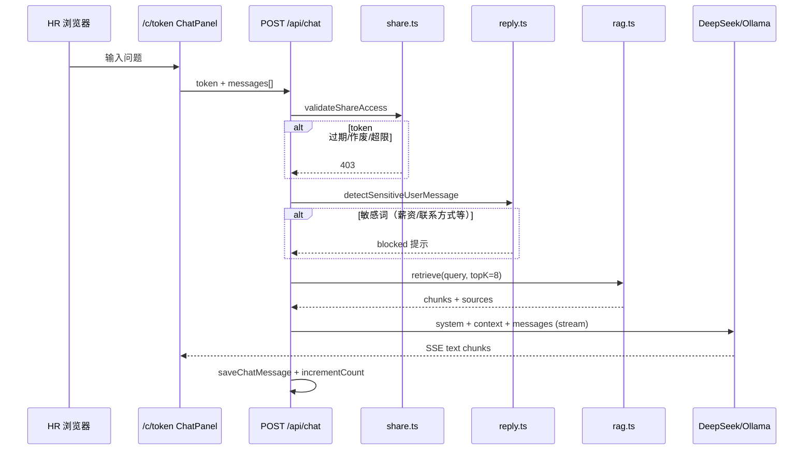

### 6.2 Boss Channel（同步 JSON）

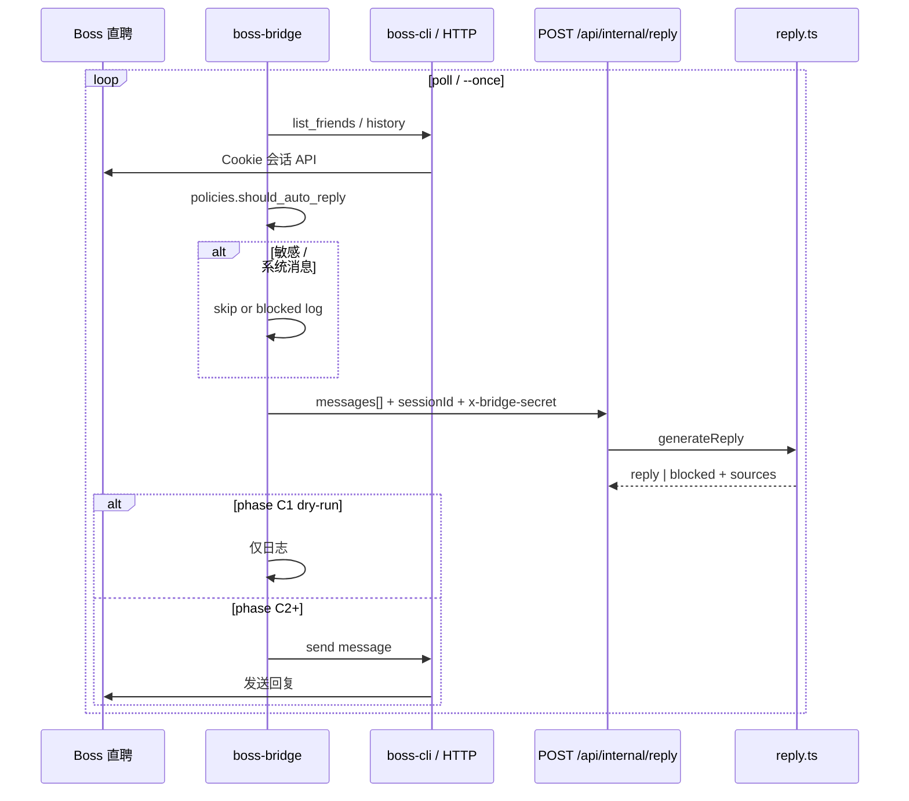

### 6.3 RAG 检索（简化）

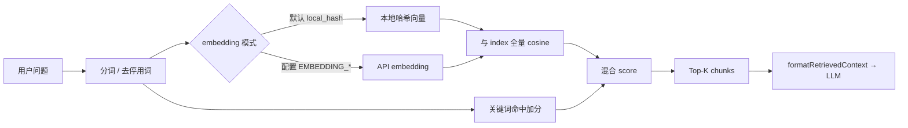

---

## 7. Boss Bridge 结构

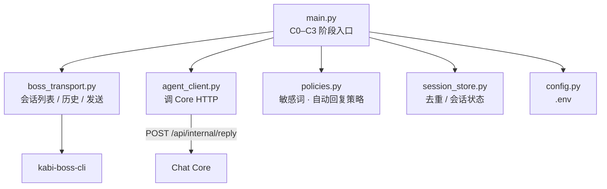

| 阶段 | 命令 | 行为 |
|------|------|------|
| **C0** | `--phase c0` | 验证 Cookie + 会话列表 |
| **C1** | `--phase c1 --once --limit 3` | dry-run 生成回复，不发送 |
| **C2** | `--phase c2` | 非敏感自动发送 |
| **C3** | 规划 | 审计、频控、人工复核队列 |

Bridge 与 Core **双重敏感拦截**：`policies.py` + `reply.ts`。

---

## 8. 仓库目录总览

```text
personal-hr-agent/
├── src/
│   ├── app/
│   │   ├── page.tsx                 # 首页
│   │   ├── admin/page.tsx           # Owner 管理台
│   │   ├── c/[token]/page.tsx       # HR 分享对话页
│   │   └── api/
│   │       ├── chat/route.ts        # Guest SSE
│   │       ├── internal/reply/      # Channel 同步 API
│   │       ├── share/               # 链接 CRUD
│   │       └── health/
│   ├── components/ChatPanel.tsx
│   └── lib/                         # Core 逻辑（见 §4）
├── boss-bridge/                     # Python Channel（Boss）
├── scripts/
│   ├── index-knowledge.ts           # 建索引
│   ├── run-eval.ts                  # 检索 / LLM 评测
│   ├── smoke.ts · smoke-bridge.ts
│   └── setup-personal-knowledge.py  # 本地知识库初始化
├── evals/golden.jsonl
├── docs/
│   ├── PROJECT_ARCHITECTURE.md      # ← 本文
│   ├── PERSONAL_HR_AGENT_SPEC.md    # 实现规格真源
│   └── roadmap/                     # 演进规划
├── knowledge/MOVED.md               # 知识库已迁至机外
└── data/                            # 运行时（gitignore）
```

---

## 9. 部署拓扑（推荐）

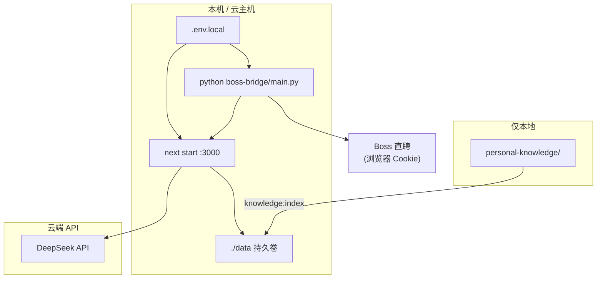

| 组件 | 运行方式 | 备注 |
|------|----------|------|
| Chat Core | `npm run dev` / `npm start` | 需 Node.js，`runtime=nodejs` |
| 知识库 | 本机目录 | `KNOWLEDGE_DIR` 指向 `personal-knowledge` |
| Boss Bridge | 独立 Python venv | 需 `kabi-boss-cli` + Chrome Cookie |
| LLM | API 或本机 Ollama | 生产推荐 DeepSeek |
| 持久化 | 挂载 `data/` | 不适合无盘 Serverless |

---

## 10. 安全与策略摘要

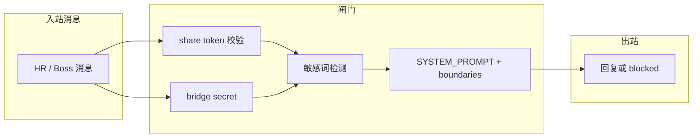

| 话题 | Boss 自动回复 | 分享页 |
|------|---------------|--------|
| 薪资 | 对方问：约 30W / 期望 35W | 同左 |
| 微信/电话 | blocked | 邮箱可说；电话谨慎 |
| 到岗 | 约 2 周 | 同左 |
| 外包身份 | 不主动提 | HR 问再说 |
| 无检索依据 | 拒答 | 拒答 |

详见本地知识库 `05-技能与问答/boundaries.md` 与 [`roadmap/security/SECRETS.md`](./roadmap/security/SECRETS.md)。

---

## 11. 已实现 vs 规划中

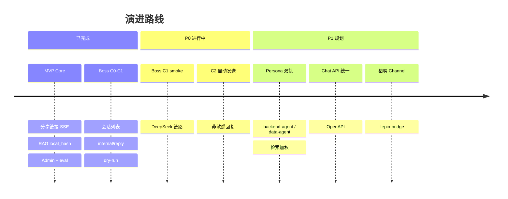

| 能力 | 状态 | 文档 |
|------|------|------|
| Guest 流式对话 | ✅ | SPEC §4 |
| 本地 RAG + 索引 | ✅ | `roadmap/rag/DESIGN.md` |
| 分享链接生命周期 | ✅ | `src/lib/share.ts` |
| Boss C0 / C1 | ✅ | `boss-bridge/PROGRESS.md` |
| 按岗位 Persona + 检索偏好 | 🔲 P1 | `roadmap/chat/PERSONA_BY_ROLE.md` |
| 会话级记忆 | 🔲 P2 | `roadmap/memory/DESIGN.md` |
| Hybrid ES / rerank | 🔲 P1 可选 | `roadmap/rag/DESIGN.md` |

---

## 12. 本地开发一键命令

```bash
# Terminal 1 — Core
cd personal-hr-agent
npm run knowledge:index   # 改 knowledge 后
npm run dev               # http://localhost:3000

# Terminal 2 — Boss dry-run（可选）
cd personal-hr-agent/boss-bridge
python main.py --phase c1 --once --limit 3

# 验证
npm run smoke
npm run smoke:bridge
npm run eval:retrieval
```

---

## 13. 相关文档索引

| 文档 | 用途 |
|------|------|
| [`PERSONAL_HR_AGENT_SPEC.md`](./PERSONAL_HR_AGENT_SPEC.md) | 实现规格「必须/不做」 |
| [`roadmap/README.md`](./roadmap/README.md) | 待开发功能总览 |
| [`roadmap/ARCHITECTURE.md`](./roadmap/ARCHITECTURE.md) | Core/Channel 分离原则 |
| [`roadmap/chat/PERSONA_BY_ROLE.md`](./roadmap/chat/PERSONA_BY_ROLE.md) | 双轨人格规划 |
| [`boss-bridge/README.md`](../boss-bridge/README.md) | Boss 接入说明 |
| [`CLAUDE.md`](../CLAUDE.md) | Agent 工作约定 |

---

*本文描述**当前代码与部署**；规格冲突以 `PERSONAL_HR_AGENT_SPEC.md` 为准。*
